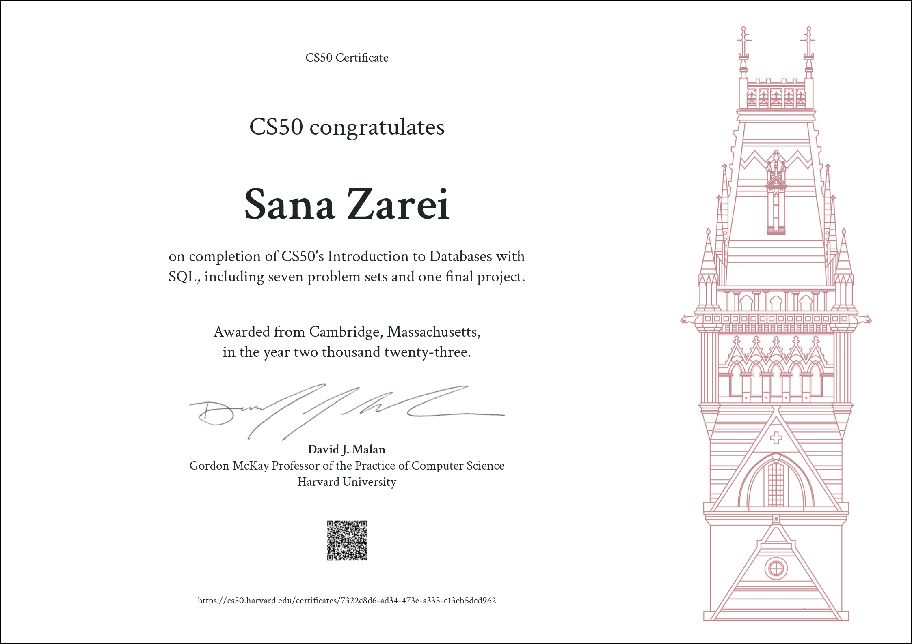

<h2 align="center">
Harvard CS50’s Introduction to Databases with SQL — CS50SQL 2023
</h2>

## Table of Contents
### [Week 0](/Week%200/)
- [Cyberchase](/Week%200/Cyberchase)
- [36 Views](/Week%200/36%20Views)
- [Normals](/Week%200/Normals)
- [Players](/Week%200/Players)

### [Week 1](/Week%201/)
- ["Packages, Please"](/Week%201/"Packages,%20Please")
- [DESE](/Week%201/DESE)
- [Moneyball](/Week%201/Moneyball)

### [Week 2](/Week%202/)
- [ATL](/Week%202/ATL)
- [Happy to Connect](/Week%202/Happy%20to%20Connect)
- [Union Square Donuts](/Week%202/Union%20Square%20Donuts)

### [Week 3](/Week%203/)
- [Don't Panic!](/Week%203/Don't%20Panic!)
- [Meteorite Cleaning](/Week%203/Meteorite%20Cleaning)

### [Week 4](/Week%204/)
- [Census Taker](/Week%204/Census%20Taker)
- [The Private Eye](/Week%204/The%20Private%20Eye)
- [Bed and Breakfast](/Week%204/Bed%20and%20Breakfast)

### [Week 5](/Week%205/)
- [your.harvard](/Week%205/your.harvard)

### [Week 6](/Week%206/)
- [Happy to Connect (Sentimental)](/Week%206/Happy%20to%20Connect%20(Sentimental))
- [Don’t Panic! (Sentimental) with Python](/Week%206/Don’t%20Panic!%20(Sentimental)%20with%20Python)

### [Final Project](/Final%20Project)
- [Final Project](/Final%20Project/Final%20Project)

---
:warning: **Warning & Disclaimer**:
The following codes are for educational purposes only and are not intended to be used/submitted as your own solutions.

:no_entry_sign: **Cheating Violates**:
The [Academic Honesty](https://cs50.harvard.edu/python/2023/honesty/) of the course, not to mention it's totally pointless if you actually want to learn programming.

:email: **Concerns**:
I like to share my progress, which also helps motivate me to finish the course faster. However, if any directors of the course want me to take this down, I will gladly do so. Just shoot me a message via <sanazarei79@gmail.com>.
 
